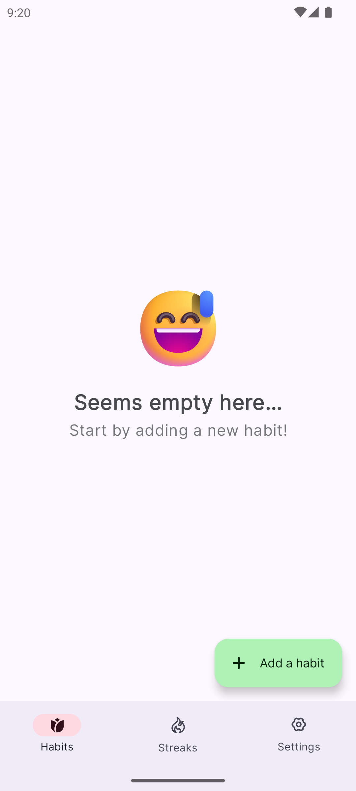

# Track-a-Habit

<div align="center">
  <!-- You can replace this with your actual app icon -->
  
  
  <h3>A modern habit tracking app for Android</h3>
  
  <p>
    <a href="#features">Features</a> •
    <a href="#screenshots">Screenshots</a> •
    <a href="#tech-stack">Tech Stack</a> •
    <a href="#architecture">Architecture</a> •
    <a href="#installation">Installation</a> •
    <a href="#contributing">Contributing</a>
  </p>
</div>

> *This README was crafted with assistance from GitHub Copilot to provide a comprehensive overview of the Track-a-Habit application architecture, features, and development approach.*

## Overview

Track-a-Habit is a minimalist yet powerful habit tracking application designed to help users build and maintain positive habits through an elegant, intuitive interface. The app combines beautiful design with powerful functionality to make habit tracking a seamless part of your daily routine.

## Features

- **Habit Management**: Create, edit, and delete habits with customizable settings
- **Streak Tracking**: Visualize your progress with streak counters and calendar views
- **Reminders**: Get notified at your preferred times to if you are about to achieve a new streak
- **Statistics**: Detailed insights and analytics about your habit performance
- **Adaptive UI Mode**: Automatically adjusts to your system theme preference
- **Offline Support**: Full functionality without an internet connection
- **Cloud Backup**: Securely back up your data to Google Drive
- **Privacy-Focused**: Your habits can be censored so that they are not visible to anyone else

## Screenshots

<div align="center">
  
  
  
</div>

## Tech Stack

Track-a-Habit is built with modern Android development tools and practices:

### UI & Architecture
- **Jetpack Compose**: Declarative UI toolkit for native UI
- **Material 3**: Latest Material Design components and theming
- **MVVM Architecture**: Clean separation of UI, business logic, and data
- **Navigation Component**: Type-safe navigation with Compose

### Core Libraries
- **Kotlin Flows & Coroutines**: Reactive programming and asynchronous operations
- **Kotlin Serialization**: Type-safe JSON serialization
- **Hilt**: Dependency injection throughout the app
- **Biometric Library**: Secure authentication for censoring habit names

### Data & Storage
- **Room Database**: Local persistence for habit data
- **DataStore**: Preferences storage with type safety
- **WorkManager**: Background scheduling for notifications and syncing
- **Google Drive API**: Optional cloud backup of user data

### Authentication & Security
- **Credential Manager API**: Secure authentication for Google Drive integration
- **Encrypted Preferences**: Secure storage of sensitive information

### Testing
- **JUnit5**: Unit testing framework
- **Turbine**: Testing of Flow-based code
- **MockK**: Mocking library for Kotlin
- **Strikt**: Fluent assertion library for Kotlin tests
- **Compose UI Testing**: UI testing with Compose Test

## Architecture

Track-a-Habit follows Android-recommended architecture principles with _MVVM_ presentation pattern.

The app is structured into three main layers:
- **Presentation Layer**: Contains UI components, ViewModels, and navigation logic. Uses Jetpack Compose for building the UI.
- **Domain Layer**: Contains business logic, use cases, and interfaces. This layer is independent of any framework or library
- **Data Layer**: Handles data sources, repositories, and data persistence. It abstracts the details of how data is fetched and stored.

### Development Approach

The project is built using a bottom-up development approach:

1. **Data Layer First**: Repository interfaces and implementations are developed and tested thoroughly
2. **Domain Layer Second**: Use cases are implemented with comprehensive test coverage
3. **Presentation Layer Last**: UI components are created only after the underlying business logic is solid

This approach ensures:
- **Testability**: Core business logic is fully tested independent of UI
- **Stability**: The foundation is solid before UI development begins
- **Flexibility**: UI can evolve without breaking the underlying functionality

All modules are developed with comprehensive unit tests before moving up the stack, ensuring the app is built on a solid foundation.

## Installation

### From GitHub Releases
1. Download the latest APK from the [Releases](https://github.com/rhenwinch/track-a-habit/releases) page
2. Install the APK on your Android device

### From Source
1. Clone the repository
   ```bash
   git clone https://github.com/rhenwinch/track-a-habit.git
   ```
2. Open the project in Android Studio
3. Build and run the app on your device or emulator

## Contributing

Contributions are welcome! Please feel free to submit pull request.
