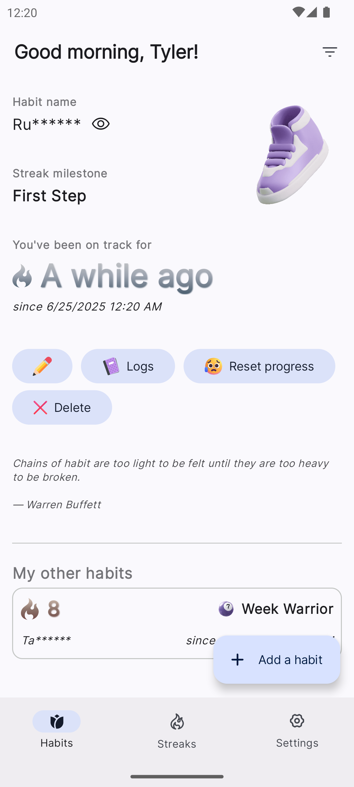
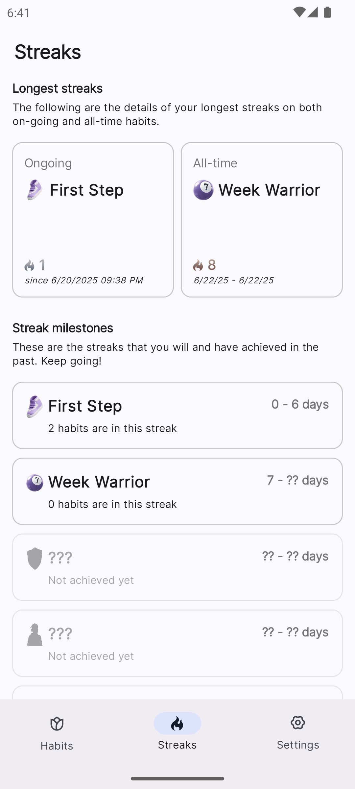

# Track a Habit


A modern habit tracking app for Android

<div>
  <a href="https://github.com/rhenwinch/track-a-habit/releases/latest">
    
  </a>
</div>

<div>
    <a href="https://github.com/rhenwinch/track-a-habit/actions/workflows/unit-tests.yaml">
        
    </a>
</div>

<div>
    <a href="https://github.com/rhenwinch/track-a-habit/actions/workflows/instrumented-tests.yaml">
        
    </a>
</div>

<div>
    <a href="https://github.com/rhenwinch/track-a-habit/actions/workflows/pre-merge.yaml">
        
    </a>
</div>

---

[Screenshots](#screenshots) • [Overview](#overview) • [Features](#features) • [Roadmap](#roadmap) • [Tech stack](#tech-stack) • [Architecture](#architecture) • [Development](#development) • [Contributing](#contributing)

> *This README is written by an AI!!!!*

## Screenshots

<div>
  
  
  
  
</div>

## Overview

*Track a Habit* is a minimalist yet powerful habit tracking application designed to help users build and maintain
positive habits through an elegant, intuitive interface. The app combines beautiful design with powerful functionality to make habit tracking a seamless part of your daily routine.

## Features

- **Habit management**: Create, edit, and delete habits with customizable settings
- **Streak tracking**: Visualize your progress with streak counters and calendar views
- **Reminders**: Get notified at your preferred times to if you are about to achieve a new streak
- **Statistics**: Detailed insights and analytics about your habit performance
- **Adaptive UI mode**: Automatically adjusts to your system theme preference
- **Offline support**: Full functionality without an internet connection
- **Cloud backup**: Securely back up your data to Google Drive
- **Privacy-focused**: Your habits can be censored so that they are not visible to anyone else

## Roadmap

Current development priorities:

- [x] Google drive backup implementation
- [x] Re-design implementation of `Streaks` to support i18n in the future
- [ ] Google drive auto backup using `WorkManager`
- [ ] Re-design implementation of `Quotes` to support i18n in the future
- [ ] Add more statistics and insights
- [ ] Add widget support

## Tech stack

*Track a Habit* is built with modern Android development tools and practices.

### UI & Navigation
- Jetpack Compose
- Material 3
- Navigation Compose *(will be using nav3 when it is stable)*

### DI
- Hilt

### Local Storage
- Room Database
- DataStore Preferences

### Authentication & Cloud
- Google Drive API
- Biometric Authentication
- Credentials Manager

### Background Processing
- WorkManager

### Testing
- JUnit
- MockK
- Strikt
- Turbine

### Code Quality
- Detekt

## Architecture

*Track a Habit* follows Android-recommended architecture principles with MVVM presentation pattern, structured into three main layers: Presentation, Domain, and Data.

## Development

### From GitHub Releases

1. Download the latest APK from the [Releases](https://github.com/rhenwinch/track-a-habit/releases) page
2. Install the APK on your Android device

### From Source

1. Clone the repository
   ```bash
   git clone https://github.com/rhenwinch/track-a-habit.git
   ```
2. Open the project in Android Studio
3. Build and run the app on your device or emulator

## Contributing

Contributions are welcome! Please feel free to submit pull request.
